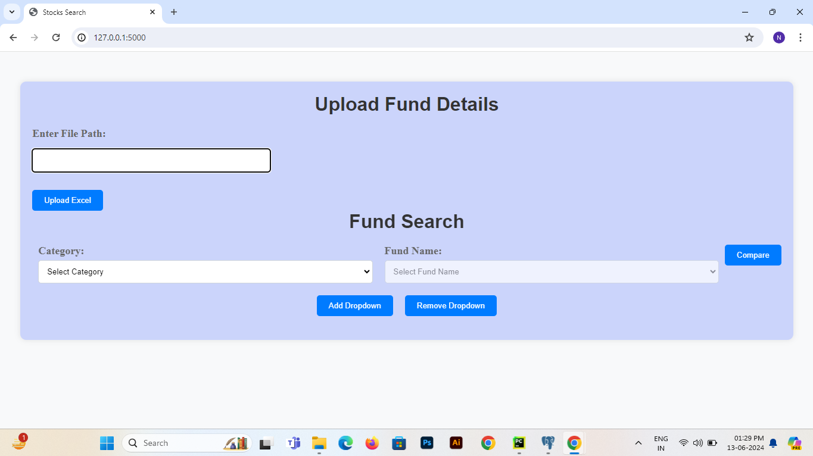
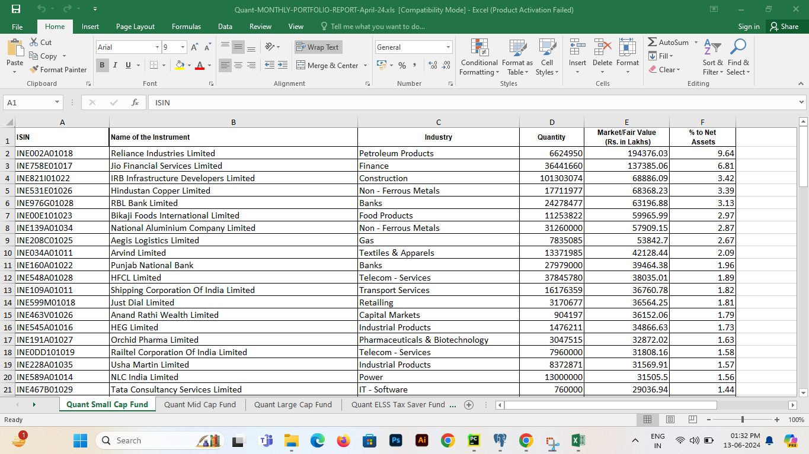
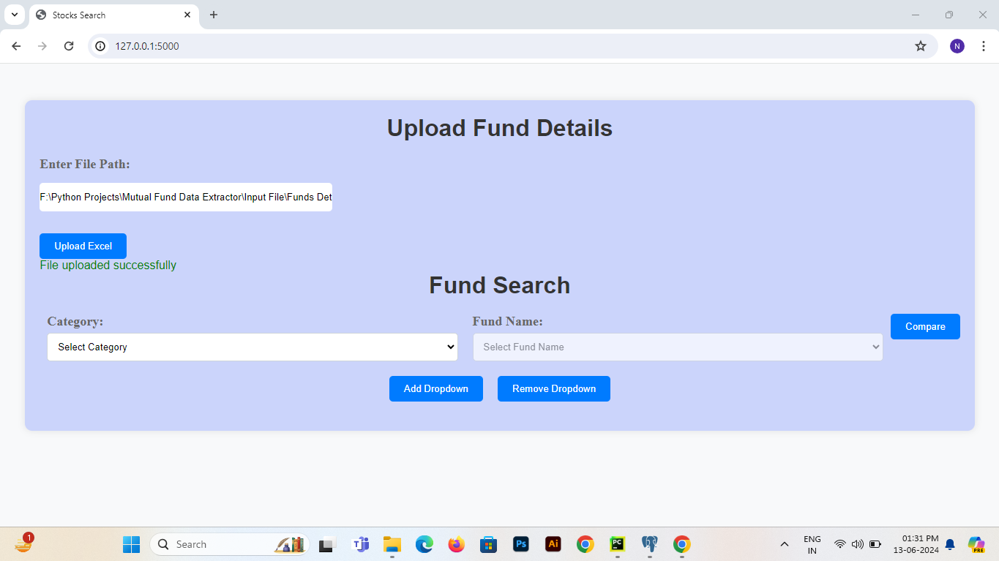
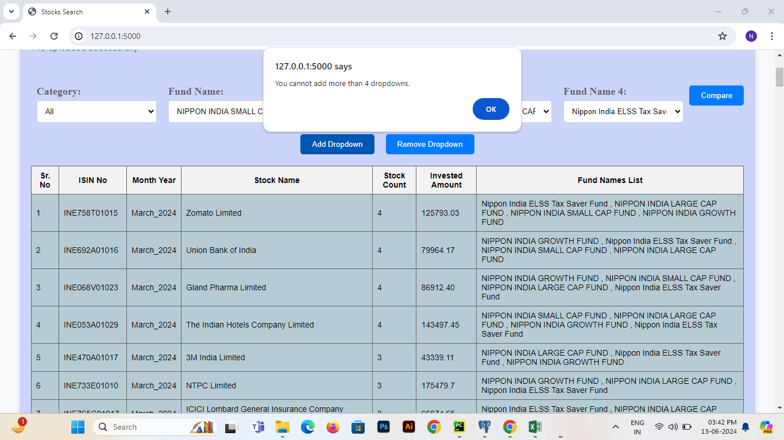
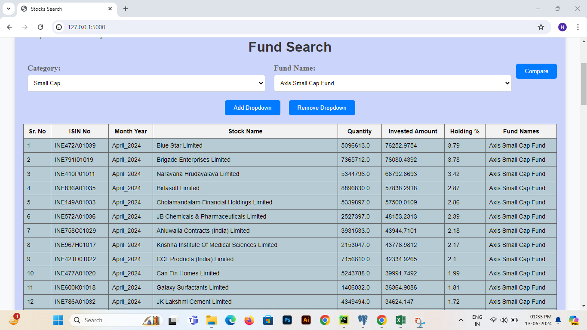
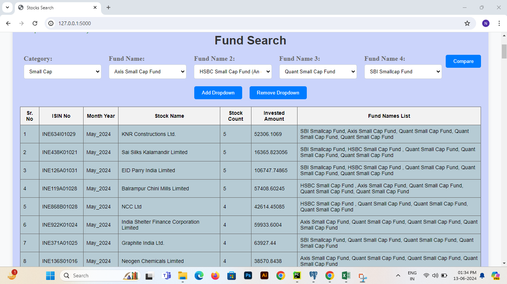
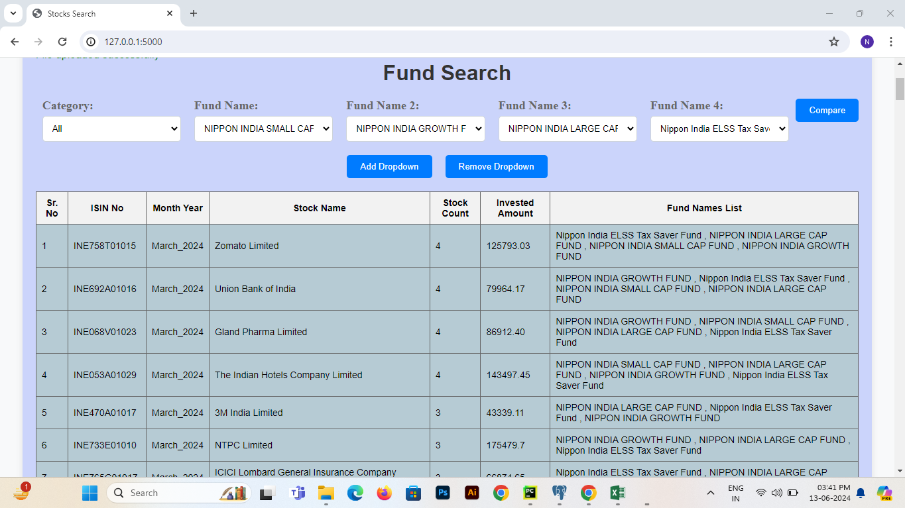
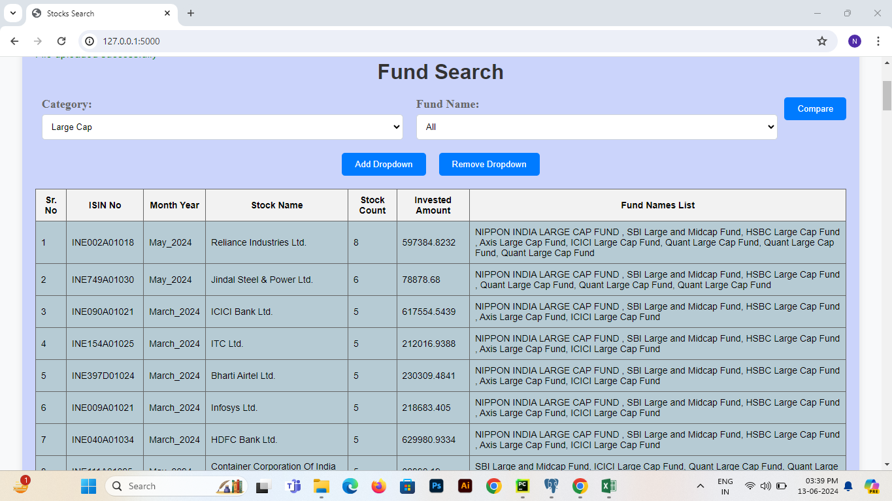
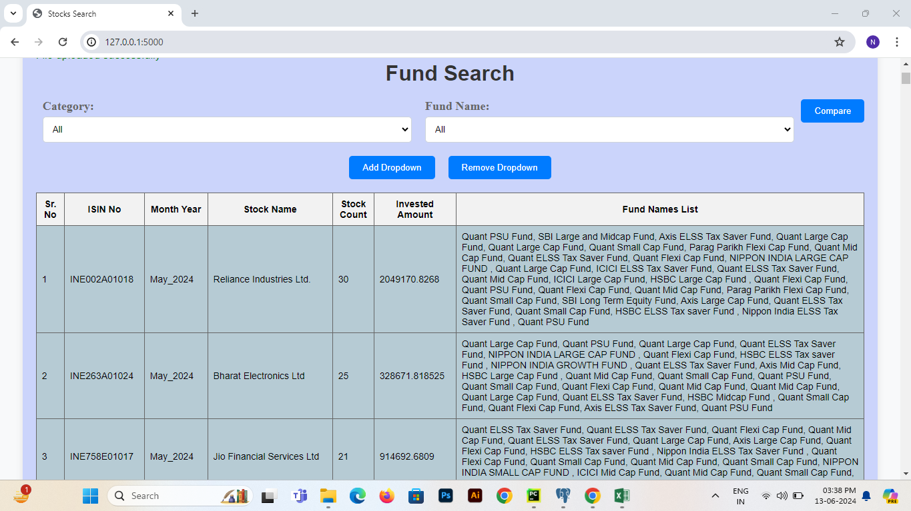

# Mutual Fund Data Analysis
**This process involves inserting mutual fund data into the database by reading the Excel input provided by the user and identifying common stocks across different mutual funds.**

### Below are the steps and screenshots demonstrating how the process works:

**1. Run Project**
- Run the app.py file to start the project.

**2. Homepage Sections**

The homepage has two sections:
- "Upload Funds Details"
- "Fund Search"

**3. Upload Fund Details**

Step 1. Create an Excel file in the specified format containing stock details of the fund.
    

Step 2. Enter the file path in the "Enter Excel File" textbox on the homepage.

Step 3. Click the "Upload Excel" button to read and insert the data in the database.
    

**4. Fund Search: Stocks Comparison**

Category Selection:
- Select a category to display the available funds in the "Fund Names" dropdown.
Add/Remove Dropdown:
- Add up to four fund name dropdowns by clicking the "Add Dropdown" button.
- Remove dropdowns by clicking the "Remove Dropdown" button. 

Comparison Scenarios:
- Single Fund Comparison:
    - Select a category.
    - Choose a fund name.
    - Click the "Compare" button to see the stocks available in the selected fund.
    
- Multiple Fund Comparison:
    - Select a category.
    - Choose up to four fund names.
    - Click the "Compare" button to see the common stocks available in the selected funds.
    
- All Category Multiple Fund Comparison:
    - Select "All" as the category.
    - Choose a fund name or up to four fund names.
    - Click the "Compare" button to see the common stocks available in the selected funds.
    
- All Funds in a Category:
    - Select a category.
    - Choose "All" as the fund name.
    - Click the "Compare" button to see the common stocks available in all funds within that category.
    
- All Funds Comparison:
    - Select "All" a both the category and fund names.
    - Click the "Compare" button to see all the common stocks available in the funds.
    

